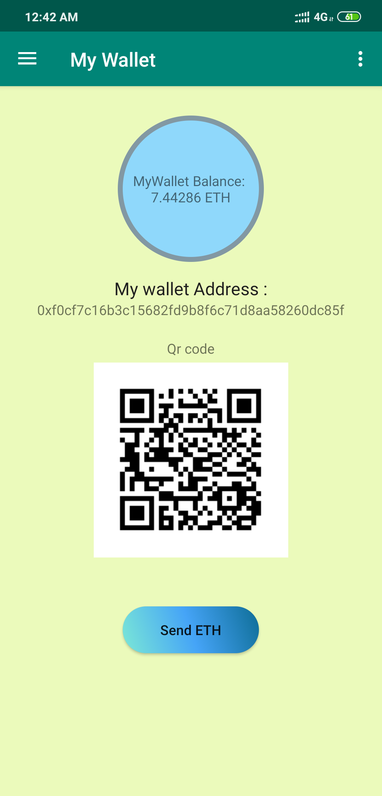
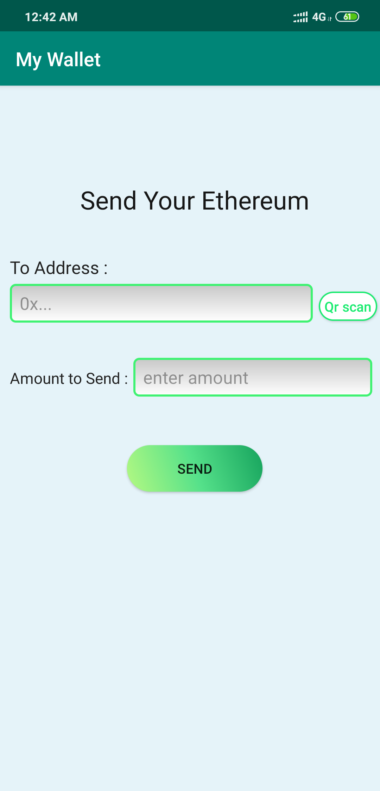
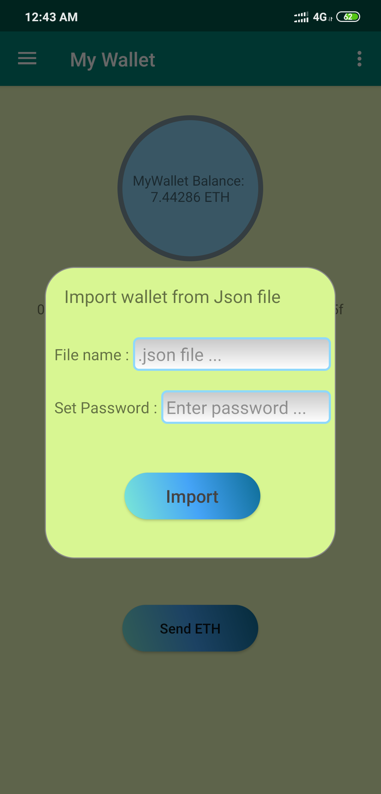
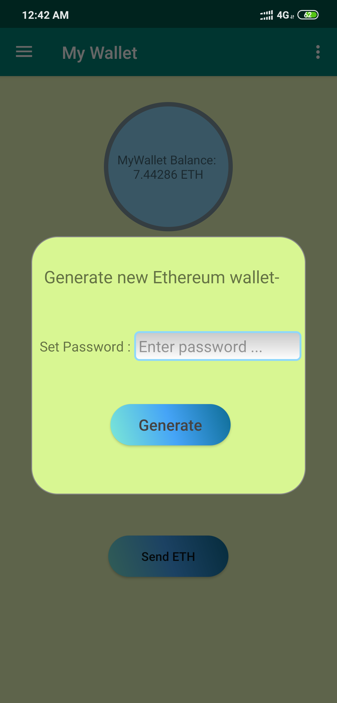
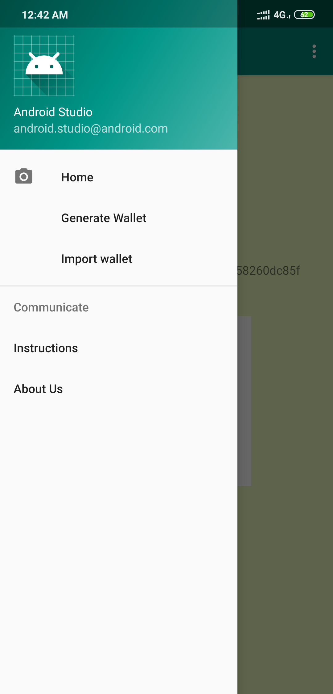

# My-Wallet-ether-transaction-
this is a android app where i have used web3j module to send ether from one account to another account.
for running this app ...
-> install update version of android studio
-> import the project
-> build the project

#for importing 
->first, create the json file from MyEtherWallet
-> then keep it in the Documents folder.
-> then copy the name of the file and input it in the filename section.
 
 

